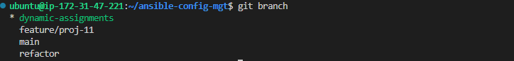
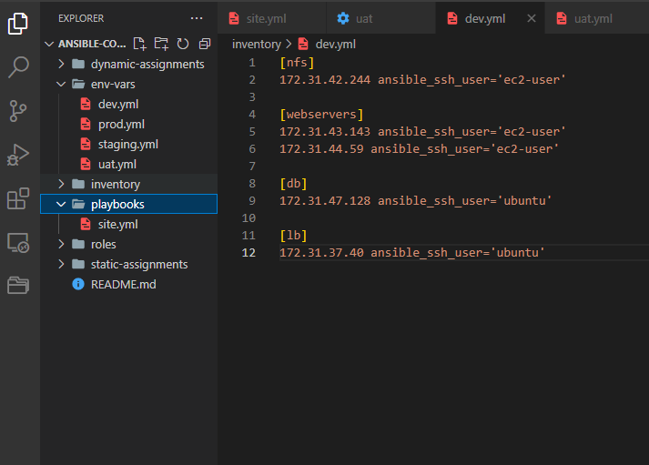
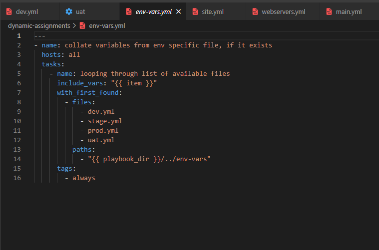
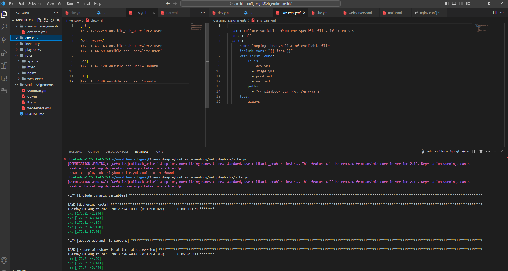
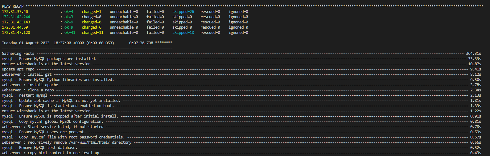

# ANSIBLE DYNAMIC ASSIGNMENTS

In this project I will be introducing ansible dynamic assignments by using the include module. This is a continuation of the project https://github.com/nwamsamson/12.ANSIBLE_REFACTORING
When the include module is used, all statements are processed only during execution of the playbook. 
Meaning, after the statements are parsed, any changes to the statements encountered during the execution will be used.

## INTRODUCING DYNAMIC ASSIGNMENTS INTO OUR STRUCTURE

In my https://github.com/nwamsamson/ansible-config-mgt github repo, I start a new branch and call it dynamic-assignemnts. 



A new folder is created named dynamic-assigments where we will build our structure. 



The following configuration is applied to the env_vars file in the dyanmic assignemnts folder



## UPDATE SITE.YML WITH DYNAMIC ASSIGNMENTS
We update the site.yml file to make use of the dynamic assignment. 
```
---
- hosts: all
- name: Include dynamic variables 
  tasks:
  import_playbook: ../static-assignments/common.yml 
  include: ../dynamic-assignments/env-vars.yml
  tags:
    - always

-  hosts: webservers
- name: Webserver assignment
  import_playbook: ../static-assignments/webservers.yml

```

Inside the roles directory, MySQL role is created with `ansible-galaxy install geerlingguy.mysql` and rename the folder to mysql
The same is done for apache and nginx with `ansible-galaxy install geerlingguy.apache` `ansible-galaxy install geerlingguy.nginx`



The env-vars/uat.yml file can be used to define which loadbalancer to use in the UAT environments by setting respective environmental variable to true. 

The ansible-playbook is run


